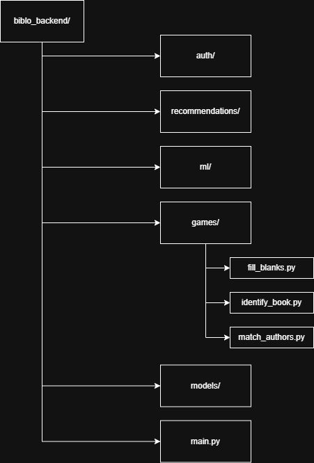
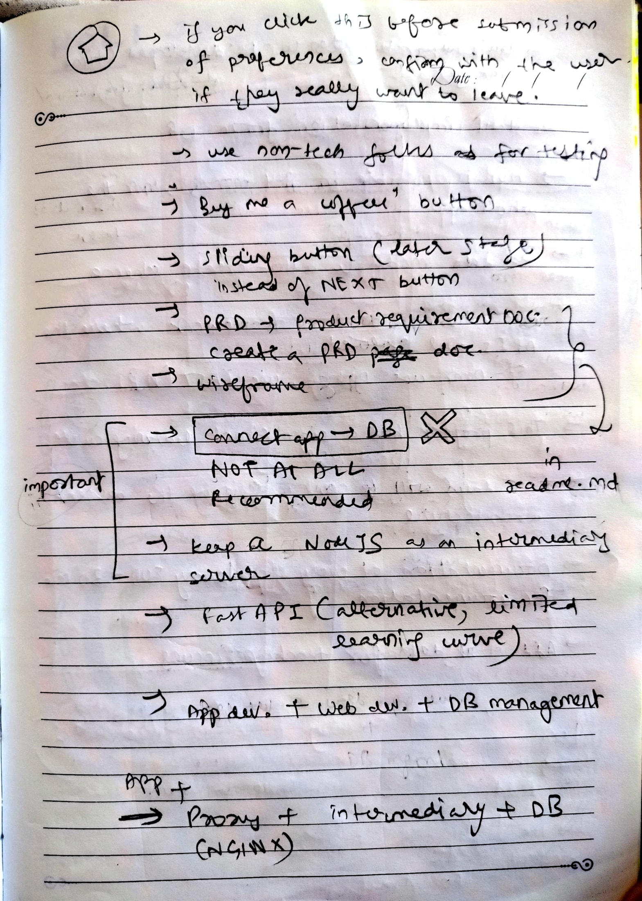
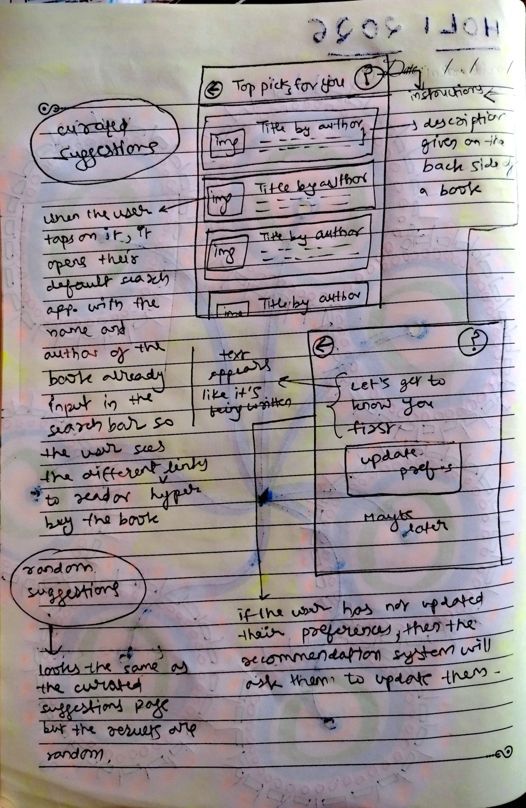
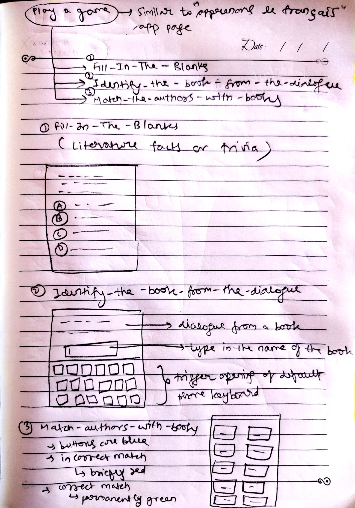

# Biblo
Reading tracker and book recommendation Android application

## Concept notes

### Recommended Architecture (Initial, small scale)
Flutter App <=> Monolith Backend API Server <=> Database

No need for proxy yet since at this stage we're not creating microservices

In the backend, there are logically separate features — physically in one service.

### Functionalities 
1. User sign-up/login 
2. Get random suggestions (nothing to do with ML) 
3. Get curated suggestions (using ML) 
4. Update preferences (for the ML component to use for generating suggestions) 
5. Play a game 

     a. Fill-In-The-Blanks 
     b. Identify-the-book-from-the-dialogue 
     c. Match-the-authors-with-the-books  

### Domains
1. Auth Domain
2. Recommendation Domain
3. Game Domain

### Modular monolith


### Database design

1. Users
```
id (UUID)
username
email
password_hash
created_at
```
2. Books
```
id
title
author
genre
theme
trope
era
setting
pub_year
```
3. Quotes
```
id
book_id (foreign key)
quote_text
difficulty_level
```
4. Games
```
id
user_id
score
started_at
ended_at
```
### Rough notes



## Concept art





