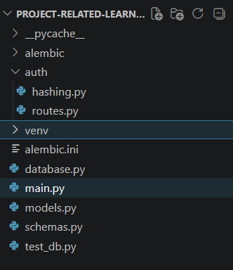
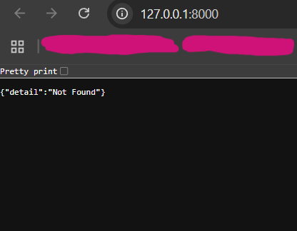
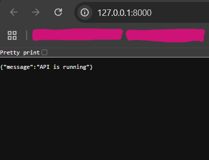
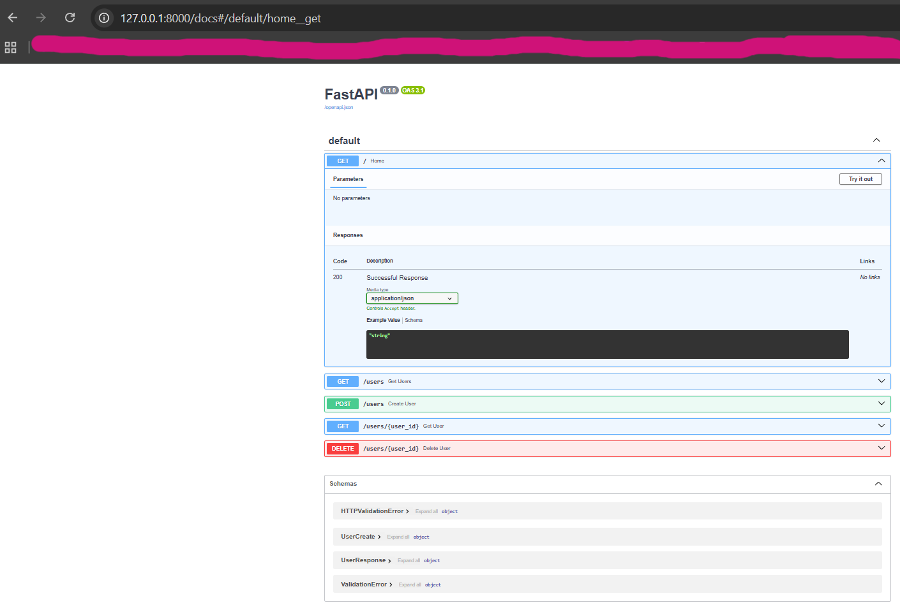
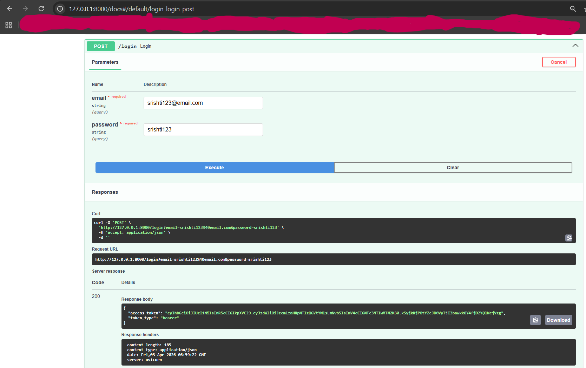
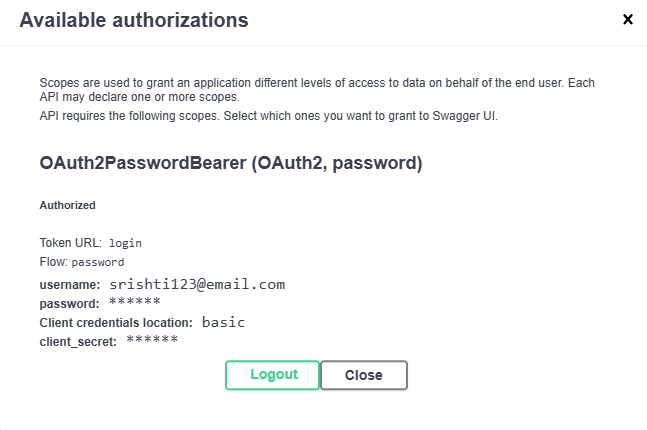
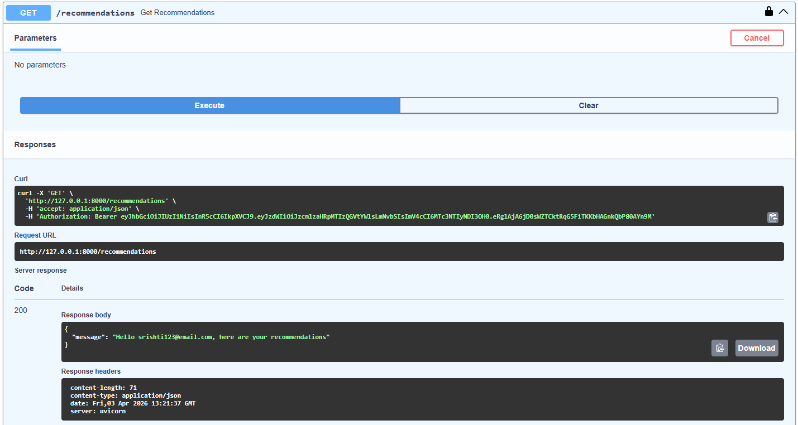

# 1. Password hashing (using bcrypt)

## 1. Setup

### a. Inside your virtual environment, run:
```
pip install passlib[bcrypt]
```
We usually use Passlib, which wraps bcrypt nicely.

### b. Recommended project structure
```
app/
│
├── auth/
│   ├── hashing.py
│   └── routes.py
│
├── models/
├── schemas/
├── db/
└── main.py
```

### c. Create hashing utility
In app/auth/hashing.py, put in:

```
# app/auth/hashing.py
from passlib.context import CryptContext

pwd_context = CryptContext(
    schemes=["bcrypt"],
    deprecated="auto"
)

def hash_password(password: str) -> str:
    return pwd_context.hash(password)

def verify_password(plain_password: str, hashed_password: str) -> bool:
    return pwd_context.verify(plain_password, hashed_password)
```

### d. Update the user model
Add the following to ```models.py```:

```
# auth update
    password_hash = Column(String, nullable=False)
```
What the updated ```models.py``` file should look like:

```
from sqlalchemy import Column, Integer, String
from database import Base

class User(Base):
    __tablename__ = "users"

    id = Column(Integer, primary_key=True, index=True)
    name = Column(String, index=True)
    email = Column(String, unique=True, index=True)

    # added a new column to the table "users"
    favorite_genre = Column(String, index=True)

    # auth update
    password_hash = Column(String, nullable=False)
```

### e. Setup a signup route
Add the following to ```routes.py```:

```
from fastapi import APIRouter, Depends
from sqlalchemy.orm import Session
from auth.hashing import hash_password
from models import User
from auth.hashing import verify_password

router = APIRouter()

@router.post("/signup")
def signup(email: str, password: str, db: Session):
    hashed = hash_password(password)

    new_user = User(
        email=email,
        password_hash=hashed
    )

    db.add(new_user)
    db.commit()

    return {"message": "User created"}
```

### f. Setup the login route
Add the following to ```routes.py```:

```
@router.post("/login")
def login(email: str, password: str, db: Session):
    user = db.query(User).filter(User.email == email).first()

    if not user:
        return {"error": "Invalid credentials"}

    if not verify_password(password, user.password_hash):
        return {"error": "Invalid credentials"}

    return {"message": "Login success"}
```

Here, notice this:

```
if not user:
    return {"error": "Invalid credentials"}
```
and:
```
if not verify_password(...):
    return {"error": "Invalid credentials"}
```
We use the same message for both, and this is a good security practice because it prevents attackers from knowing whether the email exists.

### g. Testing
If the current state of the project structure is as follows:
<br>

<br>
And the ```main.py``` file looks like this:
```
from fastapi import FastAPI, Depends, HTTPException
from sqlalchemy.orm import Session

import models
import schemas
from database import engine, get_db
from models import Base, User

app = FastAPI()

Base.metadata.create_all(bind=engine)


@app.post("/users", response_model=schemas.UserResponse)
def create_user(user: schemas.UserCreate, db: Session = Depends(get_db)):
    new_user = User(name=user.name, email=user.email)
    db.add(new_user)
    db.commit()
    db.refresh(new_user)
    return new_user


@app.get("/users")
def get_users(db: Session = Depends(get_db)):
    return db.query(User).all()


@app.get("/users/{user_id}")
def get_user(user_id: int, db: Session = Depends(get_db)):
    user = db.query(User).filter(User.id == user_id).first()

    if not user:
        raise HTTPException(status_code=404, detail="User not found")

    return user


@app.delete("/users/{user_id}")
def delete_user(user_id: int, db: Session = Depends(get_db)):
    user = db.query(User).filter(User.id == user_id).first()

    if not user:
        raise HTTPException(status_code=404, detail="User not found")

    db.delete(user)
    db.commit()

    return {"message": "User deleted"}
```

Then, when you run the command:
```
uvicorn main:app --reload
```
You see the following output on the terminal:
```
(venv) PS X:\xxxx\xxxx\xxxx\xxxx\project-related-learning> uvicorn main:app --reload
INFO:     Will watch for changes in these directories: ['X:\\xxxx\\xxxx\\xxxx\\xxxx\\project-related-learning']
INFO:     Uvicorn running on http://127.0.0.1:8000 (Press CTRL+C to quit)
INFO:     Started reloader process [22668] using StatReload
INFO:     Started server process [10724]
INFO:     Waiting for application startup.
INFO:     Application startup complete.
INFO:     127.0.0.1:51817 - "GET / HTTP/1.1" 404 Not Found
INFO:     127.0.0.1:51817 - "GET /favicon.ico HTTP/1.1" 404 Not Found
INFO:     127.0.0.1:50177 - "GET / HTTP/1.1" 404 Not Found
INFO:     127.0.0.1:50177 - "GET / HTTP/1.1" 404 Not Found
```
And on the browser:
<br>

<br>
This is because:<br>
i. Your FastAPI server is running perfectly. <br>
ii. You visited http://127.0.0.1:8000/ <br>
iii. But you haven’t created a route for / yet <br>
iv. So FastAPI is saying: “I’m running, but no endpoint exists at the homepage.” <br>
v. Right now, your app does not have the route: ```@app.get("/")``` <br>
vi. So, the root page returns 404. <br>
vii. To fix this, add the following to your ```main.py``` file:
```
from fastapi import FastAPI

app = FastAPI()

@app.get("/")
def home():
    return {"message": "API is running"}
```
So, now your main.py file should look like:
```
from fastapi import FastAPI, Depends, HTTPException
from sqlalchemy.orm import Session

import models
import schemas
from database import engine, get_db
from models import Base, User
from auth.routes import router as auth_router

app = FastAPI()
app.include_router(auth_router)
# This tells FastAPI:
# “Take all routes from auth/routes.py and add them to the app.”

Base.metadata.create_all(bind=engine)

@app.get("/")
def home():
    return {"message": "API is running"}


@app.post("/users", response_model=schemas.UserResponse)
def create_user(user: schemas.UserCreate, db: Session = Depends(get_db)):
    new_user = User(name=user.name, email=user.email)
    db.add(new_user)
    db.commit()
    db.refresh(new_user)
    return new_user


@app.get("/users")
def get_users(db: Session = Depends(get_db)):
    return db.query(User).all()


@app.get("/users/{user_id}")
def get_user(user_id: int, db: Session = Depends(get_db)):
    user = db.query(User).filter(User.id == user_id).first()

    if not user:
        raise HTTPException(status_code=404, detail="User not found")

    return user


@app.delete("/users/{user_id}")
def delete_user(user_id: int, db: Session = Depends(get_db)):
    user = db.query(User).filter(User.id == user_id).first()

    if not user:
        raise HTTPException(status_code=404, detail="User not found")

    db.delete(user)
    db.commit()

    return {"message": "User deleted"}
```
Now, run:
```
uvicorn main:app --reload
```
And you'll get the following output on the terminal:
```
INFO:     Will watch for changes in these directories: ['X:\\xxxx\\xxxx\\xxxx\\xxxx\\project-related-learning']
INFO:     Uvicorn running on http://127.0.0.1:8000 (Press CTRL+C to quit)
INFO:     Started reloader process [21764] using StatReload
INFO:     Started server process [36672]
INFO:     Waiting for application startup.
INFO:     Application startup complete.
INFO:     127.0.0.1:56923 - "GET / HTTP/1.1" 200 OK
```
And on the browser:



# 2. JWT Tokens

## 1. Installation and setup
### 1. Inside the virtual environment, run the following command:
```
pip install python-jose[cryptography]
```
### 2. Now, create a new file named ```auth/token.py``` as a token utility, and put the following code inside it:
```
# auth/token.py
# This is a token generator

from datetime import datetime, timedelta, timezone
from jose import jwt

SECRET_KEY = "my-fastapi-jwt-secret-key-for-testing-12345"
ALGORITHM = "HS256"
ACCESS_TOKEN_EXPIRE_MINUTES = 30


def create_access_token(data: dict):
    to_encode = data.copy()

    expire = datetime.now(timezone.utc) + timedelta(
        minutes=ACCESS_TOKEN_EXPIRE_MINUTES
    )

    to_encode.update({"exp": expire})

    return jwt.encode(to_encode, SECRET_KEY, algorithm=ALGORITHM)
```
Here, the line ```jwt.encode(...)``` creates the token. The token stores:
* user email
* expiry time
* cryptographic signature

<strong>NOTE:</strong> The signature prevents tampering.

<strong>Example usage:</strong> <br>
This:
```token = create_access_token({"sub": user.email})```
creates a signed token where:
```
{
  "sub": "srishti@email.com",
  "exp": "30 minutes later"
}
```
### 3. Update the login route
Now update ```auth/routes.py``` as follows:
```
from auth.token import create_access_token
```

And replace the initial login route:
```
@router.post("/login")
def login(email: str, password: str, db: Session = Depends(get_db)):
    user = db.query(User).filter(User.email == email).first()

    if not user:
        return {"error": "Invalid credentials"}

    if not verify_password(password, user.password_hash):
        return {"error": "Invalid credentials"}

    return {"message": "Login success"}
```
with the new one:
```
@router.post("/login")
def login(email: str, password: str, db: Session = Depends(get_db)):
    user = db.query(User).filter(User.email == email).first()

    if not user:
        return {"error": "Invalid credentials"}

    if not verify_password(password, user.password_hash):
        return {"error": "Invalid credentials"}

    token = create_access_token({"sub": user.email})

    return {
        "access_token": token,
        "token_type": "bearer"
    }
```
Your ``` auth/routes.py``` file should now look like this:
```
from fastapi import APIRouter, Depends
from sqlalchemy.orm import Session
from auth.hashing import hash_password
from models import User
from auth.hashing import verify_password
from database import get_db
from auth.token import create_access_token

router = APIRouter()

@router.post("/signup")
def signup(email: str, password: str, db: Session = Depends(get_db)):
    hashed = hash_password(password)

    new_user = User(
        email=email,
        password_hash=hashed
    )

    db.add(new_user)
    db.commit()

    return {"message": "User created"}

#@router.post("/login")
#def login(email: str, password: str, db: Session = Depends(get_db)):
#    user = db.query(User).filter(User.email == email).first()
#
#    if not user:
#        return {"error": "Invalid credentials"}
#
#    if not verify_password(password, user.password_hash):
#        return {"error": "Invalid credentials"}
#
#    return {"message": "Login success"}

@router.post("/login")
def login(email: str, password: str, db: Session = Depends(get_db)):
    user = db.query(User).filter(User.email == email).first()

    if not user:
        return {"error": "Invalid credentials"}

    if not verify_password(password, user.password_hash):
        return {"error": "Invalid credentials"}

    token = create_access_token({"sub": user.email})

    return {
        "access_token": token,
        "token_type": "bearer"
    }
```
<strong>Expected output:</strong> <br>


<strong>Significance:</strong> <br>
Now, this token lets your frontend call:
```
GET /recommendations
Authorization: Bearer <token>
```
without logging in every time.
<strong>NOTE:</strong> <br>
* <strong> Security concept about SECRET_KEY:</strong> <br>
This line (from ```auth/token.py```):
```
SECRET_KEY = "my-fastapi-jwt-secret-key-for-testing-12345"
```
signs the token, so if someone changes the payload manually:
```
{
  "sub": "admin@email.com"
}
```
the signature becomes invalid, so the backend rejects it. That's the JWT security.
* <strong>Production best practice:</strong> <br>
Later, NEVER hardcode this. Instead, use environment variables:
```
import os
SECRET_KEY = os.getenv("SECRET_KEY")
```
But for learning this is fine.

# 3. Protecting routes

## 1. Add token verification
In ```auth/token.py```, add the following piece of code:
```
from jose import jwt, JWTError

def verify_access_token(token: str):
    try:
        payload = jwt.decode(
            token,
            SECRET_KEY,
            algorithms=[ALGORITHM]
        )

        email = payload.get("sub")

        if email is None:
            return None

        return email

    except JWTError:
        return None
```
Here, this line ```jwt.decode(...)```: <br>
&emsp; a. Checks: <br>

&emsp; &emsp; i. signature valid <br>
&emsp; &emsp; ii. secret key correct <br>
&emsp; &emsp; iii. token not expired <br> 

&emsp; b. Then extracts ```payload["sub"]``` which is the logged-in email. <br>

## 2. Create auth dependency
Create ```auth/dependencies.py``` and put in the following code:
```
from fastapi import Depends, HTTPException
from fastapi.security import OAuth2PasswordBearer
from auth.token import verify_access_token

oauth2_scheme = OAuth2PasswordBearer(tokenUrl="login")


def get_current_user(token: str = Depends(oauth2_scheme)):
    email = verify_access_token(token)

    if email is None:
        raise HTTPException(
            status_code=401,
            detail="Invalid or expired token"
        )

    return email
```
## 3. Create a protected route
In ```main.py```, add the following piece of code:
```
from auth.dependencies import get_current_user
```
And then add:
```
@app.get("/recommendations")
def get_recommendations(current_user: str = Depends(get_current_user)):
    return {
        "message": f"Hello {current_user}, here are your recommendations"
    }
```
## 4. Testing
To test the setup created so far:
a. In Swagger ```/docs```, click on "Authorize", and enter the username and password.

b. You may possibly observe the following error on the VS Code terminal:
```
(venv) PS X:\xxxx\xxxx\xxxx\xxxxx\project-related-learning> uvicorn main:app --reload INFO: Will watch for changes in these directories: ['X:\\xxxx\\xxxx\\xxxx\\xxxx\\project-related-learning'] INFO: Uvicorn running on http://127.0.0.1:8000 (Press CTRL+C to quit) INFO: Started reloader process [28532] using StatReload INFO: Started server process [25384] INFO: Waiting for application startup. INFO: Application startup complete. INFO: 127.0.0.1:50709 - "GET / HTTP/1.1" 200 OK INFO: 127.0.0.1:50709 - "GET /favicon.ico HTTP/1.1" 404 Not Found INFO: 127.0.0.1:50709 - "GET /docs HTTP/1.1" 200 OK INFO: 127.0.0.1:50709 - "GET /openapi.json HTTP/1.1" 200 OK INFO: 127.0.0.1:57347 - "POST /login HTTP/1.1" 422 Unprocessable Content INFO: 127.0.0.1:60935 - "POST /login HTTP/1.1" 422 Unprocessable Content INFO: 127.0.0.1:60935 - "POST /login HTTP/1.1" 422 Unprocessable Content WARNING: StatReload detected changes in 'auth\routes.py'. Reloading... INFO: Shutting down INFO: Waiting for application shutdown. INFO: Application shutdown complete. INFO: Finished server process [25384] Form data requires "python-multipart" to be installed. You can install "python-multipart" with: pip install python-multipart Process SpawnProcess-2: Traceback (most recent call last): File "C:\xxxx\xxxx\xxxx\xxxx\xxxx\Python\Python314\Lib\multiprocessing\process.py", line 320, in _bootstrap self.run() ~~~~~~~~^^ File "X:\xxxx\xxxx\xxxx\xxxx\xxxx\Python\Python314\Lib\multiprocessing\process.py", line 108, in run self._target(*self._args, **self._kwargs) ~~~~~~~~~~~~^^^^^^^^^^^^^^^^^^^^^^^^^^^^^ File "X:\xxxx\xxxx\xxxx\xxxx\project-related-learning\venv\Lib\site-packages\uvicorn\_subprocess.py", line 80, in subprocess_started target(sockets=sockets) ~~~~~~^^^^^^^^^^^^^^^^^ File "X:\xxxx\xxxx\xxxx\xxxx\project-related-learning\venv\Lib\site-packages\uvicorn\server.py", line 75, in run return asyncio_run(self.serve(sockets=sockets), loop_factory=self.config.get_loop_factory()) File "X:\xxxx\xxxx\xxxx\xxxx\xxxx\Python\Python314\Lib\asyncio\runners.py", line 204, in run return runner.run(main) ~~~~~~~~~~^^^^^^ File "X:\xxxx\xxxx\xxxx\xxxx\xxxx\Python\Python314\Lib\asyncio\runners.py", line 127, in run return self._loop.run_until_complete(task) ~~~~~~~~~~~~~~~~~~~~~~~~~~~~~^^^^^^ File "X:\xxxx\xxxx\xxxx\xxxx\xxxx\Python\Python314\Lib\asyncio\base_events.py", line 719, in run_until_complete return future.result() ~~~~~~~~~~~~~^^ File "X:\xxxx\xxxx\xxxx\xxxx\project-related-learning\venv\Lib\site-packages\uvicorn\server.py", line 79, in serve await self._serve(sockets) File "X:\xxxx\xxxx\xxxx\xxxx\project-related-learning\venv\Lib\site-packages\uvicorn\server.py", line 86, in _serve config.load() ~~~~~~~~~~~^^ File "X:\xxxx\xxxx\xxxx\xxxx\project-related-learning\venv\Lib\site-packages\uvicorn\config.py", line 441, in load self.loaded_app = import_from_string(self.app) ~~~~~~~~~~~~~~~~~~^^^^^^^^^^ File "X:\xxxx\xxxx\xxxx\xxxx\project-related-learning\venv\Lib\site-packages\uvicorn\importer.py", line 19, in import_from_string module = importlib.import_module(module_str) File "X:\xxxx\xxxx\xxxx\xxxx\xxxx\Python\Python314\Lib\importlib\__init__.py", line 88, in import_module return _bootstrap._gcd_import(name[level:], package, level) ~~~~~~~~~~~~~~~~~~~~~~^^^^^^^^^^^^^^^^^^^^^^^^^^^^^^ File "<frozen importlib._bootstrap>", line 1398, in _gcd_import File "<frozen importlib._bootstrap>", line 1371, in _find_and_load File "<frozen importlib._bootstrap>", line 1342, in _find_and_load_unlocked File "<frozen importlib._bootstrap>", line 938, in _load_unlocked File "<frozen importlib._bootstrap_external>", line 759, in exec_module File "<frozen importlib._bootstrap>", line 491, in _call_with_frames_removed File "X:\xxxx\xxxx\xxxx\xxxx\project-related-learning\main.py", line 8, in <module> from auth.routes import router as auth_router File "X:\xxxx\xxxx\xxxx\xxxx\project-related-learning\auth\routes.py", line 56, in <module> @router.post("/login") ~~~~~~~~~~~^^^^^^^^^^ File "X:\xxxx\xxxx\xxxx\xxxx\project-related-learning\venv\Lib\site-packages\fastapi\routing.py", line 1446, in decorator self.add_api_route( ~~~~~~~~~~~~~~~~~~^ path, ^^^^^ ...<23 lines>... generate_unique_id_function=generate_unique_id_function, ^^^^^^^^^^^^^^^^^^^^^^^^^^^^^^^^^^^^^^^^^^^^^^^^^^^^^^^^ ) ^ File "X:\xxxx\xxxx\xxxx\xxxx\project-related-learning\venv\Lib\site-packages\fastapi\routing.py", line 1382, in add_api_route route = route_class( self.prefix + path, ...<27 lines>... ), ) File "X:\xxxx\xxxx\xxxx\xxxx\project-related-learning\venv\Lib\site-packages\fastapi\routing.py", line 945, in __init__ self.dependant = get_dependant( ~~~~~~~~~~~~~^ path=self.path_format, call=self.endpoint, scope="function" ^^^^^^^^^^^^^^^^^^^^^^^^^^^^^^^^^^^^^^^^^^^^^^^^^^^^^^^^^^^ ) ^ File "X:\xxxx\xxxx\xxxx\xxxx\project-related-learning\venv\Lib\site-packages\fastapi\dependencies\utils.py", line 331, in get_dependant sub_dependant = get_dependant( path=path, ...<5 lines>... scope=param_details.depends.scope, ) File "X:\xxxx\xxxx\xxxx\xxxx\project-related-learning\venv\Lib\site-packages\fastapi\dependencies\utils.py", line 309, in get_dependant param_details = analyze_param( param_name=param_name, ...<2 lines>... is_path_param=is_path_param, ) File "X:\xxxx\xxxx\xxxx\xxxx\project-related-learning\venv\Lib\site-packages\fastapi\dependencies\utils.py", line 532, in analyze_param ensure_multipart_is_installed() ~~~~~~~~~~~~~~~~~~~~~~~~~~~~~^^ File "X:\xxxx\xxxx\xxxx\xxxx\project-related-learning\venv\Lib\site-packages\fastapi\dependencies\utils.py", line 118, in ensure_multipart_is_installed raise RuntimeError(multipart_not_installed_error) from None RuntimeError: Form data requires "python-multipart" to be installed. You can install "python-multipart" with: pip install python-multipart
```

To resolve this, install the mentioned dependency:
```
pip install python-multipart
```
This is because ```OAuth2PasswordRequestForm = Depends()``` expects data in HTML form format, not JSON. FastAPI uses python-multipart to parse that form data. Earlier your login route accepted:
```
email: str
password: str
```
Those were query params, so no extra parser needed. Now, we upgraded to ```OAuth2PasswordRequestForm``` which uses ```application/x-www-form-urlencoded```, OAuth2 standard login format. So, FastAPI needs a form-data parser package.

<strong>NOTE:</strong> <br>

JSON body:
```
{
  "email": "...",
  "password": "..."
}
```
VS <br><br>

Form data:
```
username=srishti@email.com
password=srishti123
```
OAuth2 specifically expects the second one.

Expected output on Swagger UI:


